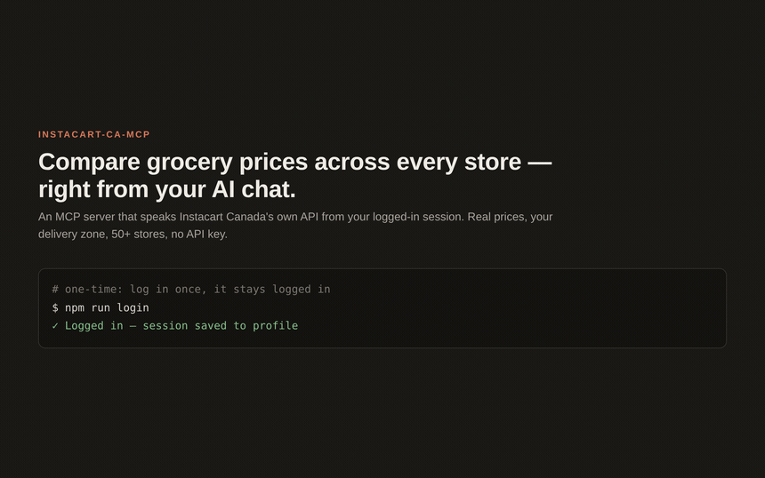

# instacart-ca-mcp

> 廣東話版：[README.zh-HK.md](./README.zh-HK.md)

An MCP server for **Instacart Canada** (`instacart.ca`). Ask your AI assistant to search products, browse categories, and compare prices across every store in your delivery zone — no clicking through the website, no API key.

**No Chrome to open, no DevTools, no debug port.** The server runs its own browser — you log in once and it stays logged in.

<p align="center">
  
</p>

> ⚠️ **Unofficial.** This drives Instacart's *internal* web GraphQL API the same way the website does, from inside your own logged-in browser session. It can break any time Instacart changes their frontend. Built for personal use. Respect Instacart's Terms of Service.

---

## What it does

Instacart's official Developer Platform API is catalog + cart only. It can't read live per-store prices for arbitrary products, and it can't see *your* zone's pricing. The website can, though, so this server reuses the website's own API by running queries inside a logged-in `instacart.ca` page. That means:

- real prices for **your** delivery zone
- every retailer Instacart lists in your area (54 in the Vancouver zone)
- no API key, no approval process
- a "No markups" flag so you know which prices are the real shelf price vs an Instacart markup

Example, in your AI chat:

> **You:** compare ground beef across Walmart, Save-On, Costco and T&T

> **Assistant:** *(calls `instacart_compare`)*
> | Store | Cheapest | |
> |---|---|---|
> | Walmart | Regular Ground Beef **$6.27** | ↑ markup |
> | Save-On-Foods | Fresh Ground Beef $8.50 | ✓ no-markup (real shelf price) |
> | Superstore | Medium Ground Beef $9.50 | ↑ markup |
> | Costco | Lean Ground Beef $38.47 (bulk) | ↑ markup |

## Tools

| Tool | What it does |
|------|--------------|
| `instacart_check` | Verify your browser session is logged in. |
| `instacart_stores` | List every retailer in your zone (live), with shopId, slug, name, type. |
| `instacart_categories` | List a store's category slugs (`meat-and-seafood`, `produce`, `frozen`, …). |
| `instacart_browse` | Browse a category at a store. **Clean** results, no cross-category noise. |
| `instacart_search` | Fuzzy search one store. Fast, but can include off-category items. |
| `instacart_compare` | Compare a product across stores, cheapest first. Add `category` for noise-free comparison; each result is tagged `noMarkup`. |
| `instacart_deals` | On-sale items at a store, with struck-through original prices. |

**Clean vs fuzzy:** plain search is fuzzy, so a store that doesn't carry an item gets padded with "you might also like" junk (dog food, makeup). `instacart_browse` and `instacart_compare`'s `category` mode use Instacart's own category collections instead, which are clean.

## Quick start

```bash
git clone https://github.com/mcpware/instacart-ca-mcp
cd instacart-ca-mcp
npm install
npx playwright install chromium   # one-time: download the Chromium it drives
npm run build
```

### Log in (one time)

The server owns its own Chromium profile, so you log in once and it stays logged in. **You never open your own browser or touch DevTools** — `npm run login` opens the server's own window. Both methods below are tested working.

**Option A — interactive login (needs a display):**

```bash
INSTACART_HEADLESS=false npm run login
```

A Chromium window opens. Log in to instacart.ca. The script detects login, saves the profile, and exits. After that the server runs headless and stays logged in.

**Option B — import cookies (headless / server machines):**

In any logged-in instacart.ca tab: DevTools → Network → click any `graphql?…` request → copy the whole `cookie:` request header, then:

```bash
INSTACART_COOKIES='device_uuid=…; __Host-instacart_sid=…; …' npm run import-cookies
# or save the cookie string to a file:
npm run import-cookies /path/to/cookies.txt
```

The `__Host-instacart_sid` cookie is the one that carries the session.

### Register with your MCP host

**Claude Code** — add to `~/.mcp.json`:

```json
{
  "mcpServers": {
    "instacart": {
      "command": "node",
      "args": ["/absolute/path/to/instacart-ca-mcp/dist/index.js"],
      "env": { "INSTACART_HEADLESS": "true" }
    }
  }
}
```

Claude Code also needs the server name in `enabledMcpjsonServers` in `~/.claude/settings.json`. Restart Claude Code, then just ask it to compare prices.

## Configuration

| Env var | Default | Purpose |
|---------|---------|---------|
| `INSTACART_HEADLESS` | `true` | `false` opens a visible window (for first-time login). |
| `INSTACART_PROFILE_DIR` | `~/.instacart-ca-mcp/profile` | Where the logged-in profile lives. |
| `INSTACART_POSTAL` | `V6B6H4` | Delivery postal code (zone-specific pricing). |
| `INSTACART_ZONE` | `755` | Instacart zone id matching the postal code. |

Store shopIds and the persisted-query hashes are captured for the Vancouver zone in `src/instacart.ts`. For another city, update `INSTACART_POSTAL` / `INSTACART_ZONE`; `instacart_stores` reads the live retailer list for your zone. See [`API.md`](./API.md) for the full reverse-engineered API reference.

## How it works

```
┌─────────────┐   stdio    ┌──────────────────┐  page.evaluate  ┌──────────────────────┐
│  AI / LLM   │ ─────────► │ instacart-ca-mcp │ ──────────────► │ own headless Chromium│
│ (MCP host)  │  JSON-RPC  │   (this server)  │   GraphQL call  │ (persistent profile) │
└─────────────┘            └──────────────────┘                 └──────────────────────┘
```

The server owns its own Chromium (Playwright `launchPersistentContext`) with a persistent profile at `~/.instacart-ca-mcp/profile`. You log in once; the session survives restarts. Every query runs *inside* that logged-in page via `page.evaluate`, so the site's httpOnly cookies are sent automatically, and we hit instacart.ca's own persisted-GraphQL endpoint exactly like the website.

Why not attach to your existing Chrome over CDP? Modern Chrome locks down the DevTools HTTP discovery endpoint (`/json`, `/json/version` return 404) and restricts the browser-level WebSocket by origin, so a standalone server can't reliably attach. Owning the browser sidesteps all of that and makes the server self-contained.

## Design journey — what we tried, and why it ended up here

There are three obvious ways to let an AI "use Instacart", and we went through all of them. The order matters, because each failure pushed the design to the next one.

**1. Scrape the website's HTML.** The naive approach: navigate the storefront, read the rendered DOM. It falls apart fast — instacart.ca is a single-page app, prices and product cards load lazily and live behind React state, the markup is obfuscated and changes constantly, and you get one store at a time, slowly. Brittle and slow.

**2. Drive *your* Chrome over CDP, then call the internal GraphQL.** Much better idea: skip the DOM, call the same internal GraphQL API the website calls, from inside a logged-in tab so cookies come for free. The catch is *attaching* to your existing Chrome. Modern Chrome (security hardening) locks down the DevTools discovery endpoints — `/json` and `/json/version` both return 404 — and restricts the browser-level WebSocket by origin. `chrome-remote-interface` fails; Playwright's `connectOverCDP` fails the same way (it hits `/json/version` too); a raw `ws://` attach times out on the origin check. Three independent attach methods, all dead. You simply can't reliably reach an external modern Chrome from a standalone server anymore.

**3. Own the browser. ← the design we shipped.** Instead of attaching to a Chrome we don't control, the server launches and *owns* its own Chromium with a persistent profile. You log in once; the session is written to disk and survives restarts. Every query runs *inside* that logged-in page via `page.evaluate`, so httpOnly cookies are sent automatically and we hit the internal persisted-GraphQL endpoint exactly like the website. Self-contained, publishable, no dependency on whatever Chrome you happen to have open.

Getting #3 actually working took a few more fixes that aren't obvious until you hit them:

- **Session cookies don't persist by default.** `__Host-instacart_sid` is a *session* cookie (no expiry), so a persistent context dropped it on close and the next headless launch was a guest again. Fix: pin a far-future expiry when importing cookies so Chromium writes them to disk.
- **Search has no category filter, so results are noisy.** A plain search at a store that doesn't carry an item gets padded with cross-category "you might also like" junk (dog food and makeup under "ground beef"). There is no per-item category field to filter on. Fix: use Instacart's own **category collections** (`instacart_browse` / compare's `category` mode) — clean by construction.
- **The search endpoint needs `x-client-identifier: web`** or it returns 401 (the login check doesn't need it — easy to miss).
- **shopIds drift.** Hand-captured shopIds go stale (Save-On was 606800, not the 25116 we first noted — that's T&T). Fix: resolve the authoritative shopId from the live store list at call time.
- **"No markups" is real signal.** The price-parity directory tells you which stores show in-store prices vs an Instacart markup, so a comparison can tag each result.

The short version: **don't scrape, and don't fight modern Chrome's CDP lockdown — own a browser, log in once, and speak the site's own GraphQL.**

## Limitations

- The login session expires after a few weeks to a few months. When `instacart_check` reports `loggedIn: false`, re-run `npm run login` or `npm run import-cookies`.
- Persisted-query hashes change when Instacart ships a new frontend bundle. If a call returns `PersistedQueryNotSupported`, re-capture the hash from the Network tab and update `HASHES` in `src/instacart.ts`.
- The constants are captured for the Vancouver zone. Other zones work for the live store list and search; some hand-picked shopIds may differ.

## Tests

```bash
node test/features.mjs   # full feature walk-through against the headless profile
node test/stdio.mjs      # MCP JSON-RPC handshake + a real tool call
```

## License

MIT
